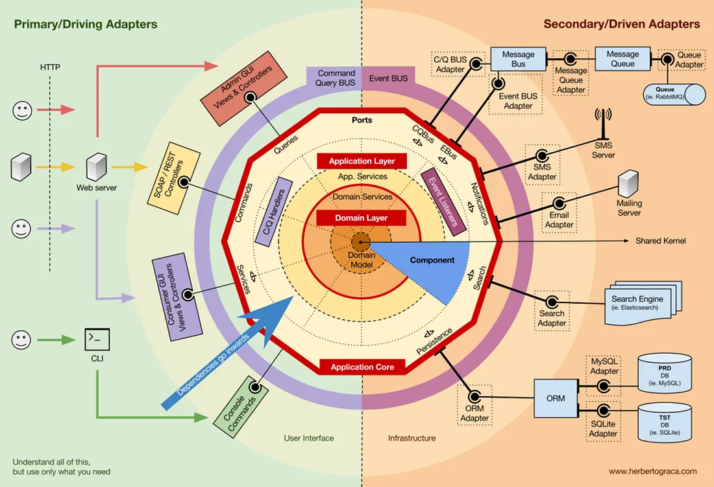

<!-- markdownlint-disable MD033 -->
<!-- markdownlint-disable MD041 -->

# Isolando o Domínio com Arquitetura Hexagonal (Ports & Adapters)

> [Voltar](../../../README.md)

## Índice

- [Isolando o Domínio com Arquitetura Hexagonal (Ports \& Adapters)](#isolando-o-domínio-com-arquitetura-hexagonal-ports--adapters)
  - [Índice](#índice)
  - [Introdução](#introdução)
  - [✅ Vantagens](#-vantagens)
  - [⚠️ Desvantagens](#️-desvantagens)
  - [Estrutura de Diretórios](#estrutura-de-diretórios)
  - [Exemplos de Código - Centro para Fora](#exemplos-de-código---centro-para-fora)
    - [1. DOMÍNIO: Coração Isolado](#1-domínio-coração-isolado)
    - [2. PORTAS: Contratos de Comunicação](#2-portas-contratos-de-comunicação)
    - [3. USE CASES: Aplicação Isolada](#3-use-cases-aplicação-isolada)
    - [4. ADAPTADORES INBOUND: HTTP](#4-adaptadores-inbound-http)
    - [5. ADAPTADORES OUTBOUND: Persistência](#5-adaptadores-outbound-persistência)
    - [6. CONTAINER DE INJEÇÃO: Montando Tudo](#6-container-de-injeção-montando-tudo)
  - [Testando com Hexagonal](#testando-com-hexagonal)
  - [Trocar Implementação: O Poder da Hexagonal](#trocar-implementação-o-poder-da-hexagonal)
    - [Trocar Banco: SQL → NoSQL](#trocar-banco-sql--nosql)
    - [Trocar Email: Sendgrid → AWS SES](#trocar-email-sendgrid--aws-ses)
    - [Trocar Framework: Express → Fastify](#trocar-framework-express--fastify)
  - [Fluxo Completo de Requisição](#fluxo-completo-de-requisição)
  - [Comparação: Hexagonal vs Camadas vs Microsserviços](#comparação-hexagonal-vs-camadas-vs-microsserviços)
  - [Quando Usar Hexagonal](#quando-usar-hexagonal)
  - [Evolução Natural para Microsserviços](#evolução-natural-para-microsserviços)
  - [Princípios-Chave da Hexagonal](#princípios-chave-da-hexagonal)
  - [Vantagem Competitiva](#vantagem-competitiva)
  - [Resumo Executivo](#resumo-executivo)
  - [Próximos Passos Práticos](#próximos-passos-práticos)

## Introdução

A **Arquitetura Hexagonal** (também conhecida como Ports & Adapters) isola o domínio no centro usando **portas** e **adaptadores**. O domínio fica completamente independente, comunicando-se com o mundo externo apenas através de interfaces bem definidas.

```plaintext
                      🌐 MUNDO EXTERNO
                      HTTP | CLI | Eventos
                          ↙ ↓ ↖
    ┌───────────────────────────────────────────────┐
    │      ADAPTADORES INBOUND (Entradas)           │
    │  PedidoController │ CliCommand │ EventListener│
    └───────────────────────────────────────────────┘
                        ↓ ↑
    ┌─────────────────────────────────────────────┐
    │      PORTAS INBOUND (Interfaces)            │
    │  IHttpServer │ ICliCommand │ IEventListener │
    └─────────────────────────────────────────────┘
                        ↓ ↑
    ┌─────────────────────────────────────────────┐
    │      USE CASES (Aplicação)                  │
    │  CriarPedidoUseCase │ ConfirmarPedidoUseCase
    └─────────────────────────────────────────────┘
                        ↓ ↑
    ┌─────────────────────────────────────────────┐
    │    🔒 DOMÍNIO (CORE - 100% ISOLADO) 🔒      │
    │  Pedido │ Cliente │ Email │ Preco │ Eventos │
    │     Sem dependências externas!              │
    └─────────────────────────────────────────────┘
                        ↓ ↑
    ┌─────────────────────────────────────────────┐
    │      PORTAS OUTBOUND (Interfaces)           │
    │ IPedidoRepository │ IEventPublisher │ IEmail 
    └─────────────────────────────────────────────┘
                        ↓ ↑
    ┌─────────────────────────────────────────────┐
    │    ADAPTADORES OUTBOUND (Implementações)    │
    │ PedidoRepositorySQL │ EmailSendgrid │ KafkaPublisher
    └─────────────────────────────────────────────┘
                        ↓ ↑
                  🌐 MUNDO EXTERNO
              Banco | Email API | Fila Mensagens
```

## ✅ Vantagens

- **Domínio completamente isolado** - Não depende de nada
- **Fácil trocar implementações** - Basta trocar adaptador
- **Altamente testável** - Mocks são naturais
- **Preparado para futuro** - Fácil adicionar novos adaptadores
- **Verdadeira flexibilidade** - Não está preso a frameworks

## ⚠️ Desvantagens

- **Mais interfaces** - Pode parecer verboso
- **Curva de aprendizado** - Conceitos são mais abstratos
- **Overhead inicial** - Mais código para projeto pequeno

<br>

<p align="center">
  
</p>

---

## Estrutura de Diretórios

```plaintext
projeto/
│
├── src/
│   │
│   ├── core/                        ← 💎 DOMÍNIO (CENTRO PROTEGIDO)
│   │   ├── domain/
│   │   │   ├── entities/
│   │   │   │   ├── Pedido.ts
│   │   │   │   ├── Cliente.ts
│   │   │   │   └── ItemPedido.ts
│   │   │   ├── value-objects/
│   │   │   │   ├── Email.ts
│   │   │   │   ├── Preco.ts
│   │   │   │   └── PedidoStatus.ts
│   │   │   ├── events/
│   │   │   │   ├── PedidoCriadoEvent.ts
│   │   │   │   ├── PedidoConfirmadoEvent.ts
│   │   │   │   └── DomainEvent.ts
│   │   │   └── services/
│   │   │       ├── PedidoService.ts
│   │   │       └── CalculadoraDesconto.ts
│   │   │
│   │   └── application/
│   │       ├── usecases/
│   │       │   ├── CriarPedidoUseCase.ts
│   │       │   ├── ConfirmarPedidoUseCase.ts
│   │       │   └── CancelarPedidoUseCase.ts
│   │       └── dto/
│   │           ├── CriarPedidoRequest.ts
│   │           └── CriarPedidoResponse.ts
│   │
│   ├── ports/                       ← 🚪 PORTAS (INTERFACES)
│   │   ├── inbound/                 ← Portas de entrada
│   │   │   ├── IHttpServer.ts
│   │   │   ├── ICliCommand.ts
│   │   │   └── IEventListener.ts
│   │   │
│   │   └── outbound/                ← Portas de saída
│   │       ├── IPedidoRepository.ts
│   │       ├── IClienteRepository.ts
│   │       ├── IEventPublisher.ts
│   │       ├── IEmailService.ts
│   │       ├── IPaymentGateway.ts
│   │       └── ILogger.ts
│   │
│   └── adapters/                    ← 🔌 ADAPTADORES (IMPLEMENTAÇÕES)
│       ├── inbound/                 ← Adaptadores de entrada
│       │   ├── http/
│       │   │   ├── PedidoController.ts
│       │   │   ├── ExpressAdapter.ts
│       │   │   └── routes/
│       │   │       └── pedidos.routes.ts
│       │   └── cli/
│       │       └── PedidoCliCommand.ts
│       │
│       ├── outbound/                ← Adaptadores de saída
│       │   ├── persistence/
│       │   │   ├── PedidoRepositorySQL.ts
│       │   │   ├── ClienteRepositorySQL.ts
│       │   │   └── database/
│       │   │       └── DatabaseConnection.ts
│       │   ├── messaging/
│       │   │   ├── EventPublisherKafka.ts
│       │   │   └── EventSubscriberKafka.ts
│       │   ├── external/
│       │   │   ├── SendgridEmailAdapter.ts
│       │   │   ├── StripePaymentAdapter.ts
│       │   │   └── ConsoleLoggerAdapter.ts
│       │   └── cache/
│       │       └── RedisCacheAdapter.ts
│       │
│       └── config/
│           └── ContainerInjection.ts
│
└── tests/
    ├── unit/
    │   ├── domain/
    │   │   ├── Pedido.test.ts
    │   │   ├── Email.test.ts
    │   │   └── PedidoService.test.ts
    │   └── application/
    │       └── CriarPedidoUseCase.test.ts
    │
    ├── integration/
    │   ├── adapters/
    │   │   ├── PedidoRepositorySQL.test.ts
    │   │   └── SendgridEmailAdapter.test.ts
    │   └── usecases/
    │       └── CriarPedidoUseCase.integration.test.ts
    │
    └── e2e/
        └── pedidos.e2e.test.ts
```

---

## Exemplos de Código - Centro para Fora

### 1. DOMÍNIO: Coração Isolado

```typescript
// src/core/domain/entities/Pedido.ts
/**
 * DOMÍNIO PURO - Sem dependências externas
 * NÃO IMPORTA de: HTTP, BD, Email, nada!
 * Só importa outras partes do domínio
 */
export class Pedido {
  private readonly id: string;
  private readonly clienteId: string;
  private readonly itens: ItemPedido[] = [];
  private status: PedidoStatus;
  private readonly dataCriacao: Date;
  private eventos: DomainEvent[] = [];

  private constructor(
    id: string,
    clienteId: string,
    dataCriacao: Date
  ) {
    this.id = id;
    this.clienteId = clienteId;
    this.status = PedidoStatus.PENDENTE;
    this.dataCriacao = dataCriacao;
  }

  static criar(clienteId: string): Pedido {
    const pedido = new Pedido(
      this.gerarId(),
      clienteId,
      new Date()
    );

    pedido.adicionarEvento(
      new PedidoCriadoEvent(pedido.id, clienteId)
    );

    return pedido;
  }

  // REGRAS DE NEGÓCIO
  adicionarItem(produtoId: string, quantidade: number, preco: Preco): void {
    if (!this.status.podeAdicionarItens()) {
      throw new Error(
        `Não pode adicionar itens a pedido em status ${this.status.valor}`
      );
    }

    if (quantidade <= 0) {
      throw new Error('Quantidade deve ser maior que zero');
    }

    this.itens.push(
      new ItemPedido(this.gerarId(), produtoId, quantidade, preco)
    );
  }

  confirmar(): void {
    if (!this.status.podeConfirmar()) {
      throw new Error(
        `Pedido em status ${this.status.valor} não pode ser confirmado`
      );
    }

    if (this.itens.length === 0) {
      throw new Error('Pedido sem itens não pode ser confirmado');
    }

    this.status = PedidoStatus.CONFIRMADO;

    this.adicionarEvento(
      new PedidoConfirmadoEvent(this.id, this.calcularTotal())
    );
  }

  cancelar(): void {
    if (!this.status.podeCancelar()) {
      throw new Error(
        `Pedido em status ${this.status.valor} não pode ser cancelado`
      );
    }

    this.status = PedidoStatus.CANCELADO;

    this.adicionarEvento(new PedidoCanceladoEvent(this.id));
  }

  calcularTotal(): Preco {
    return this.itens.reduce(
      (total, item) => total.adicionar(item.calcularSubtotal()),
      Preco.create(0)
    );
  }

  // Getters
  getId(): string { return this.id; }
  getClienteId(): string { return this.clienteId; }
  getStatus(): PedidoStatus { return this.status; }
  getItens(): ItemPedido[] { return this.itens; }
  getEventos(): DomainEvent[] { return this.eventos; }

  private adicionarEvento(evento: DomainEvent): void {
    this.eventos.push(evento);
  }

  private static gerarId(): string {
    return crypto.randomUUID();
  }
}

// src/core/domain/value-objects/Preco.ts
export class Preco {
  private readonly valor: number;
  private readonly moeda: string;

  private constructor(valor: number, moeda: string = 'BRL') {
    this.valor = valor;
    this.moeda = moeda;
  }

  static create(valor: number, moeda: string = 'BRL'): Preco {
    if (valor < 0) {
      throw new Error('Preço não pode ser negativo');
    }
    return new Preco(valor, moeda);
  }

  adicionar(outro: Preco): Preco {
    if (this.moeda !== outro.moeda) {
      throw new Error('Moedas diferentes');
    }
    return new Preco(this.valor + outro.valor, this.moeda);
  }

  get(): number {
    return this.valor;
  }
}

// src/core/domain/value-objects/Email.ts
export class Email {
  private readonly value: string;

  private constructor(value: string) {
    this.value = value;
  }

  static create(value: string): Email {
    if (!this.isValid(value)) {
      throw new Error(`Email inválido: ${value}`);
    }
    return new Email(value);
  }

  private static isValid(email: string): boolean {
    const regex = /^[^\s@]+@[^\s@]+\.[^\s@]+$/;
    return regex.test(email);
  }

  get(): string {
    return this.value;
  }

  equals(other: Email): boolean {
    return this.value === other.value;
  }
}
```

### 2. PORTAS: Contratos de Comunicação

```typescript
// src/ports/outgoing/IPedidoRepository.ts
/**
 * PORTA DE SAÍDA: O domínio PRECISA de um repositório
 * Mas não sabe nem se importa COMO é implementado
 */
export interface IPedidoRepository {
  salvar(pedido: Pedido): Promise<void>;
  obterPorId(id: string): Promise<Pedido | null>;
  obterPorClienteId(clienteId: string): Promise<Pedido[]>;
}

// src/ports/outgoing/IEventPublisher.ts
export interface IEventPublisher {
  publicar(evento: DomainEvent): Promise<void>;
  publicarMultiplos(eventos: DomainEvent[]): Promise<void>;
}

// src/ports/outgoing/IEmailService.ts
export interface IEmailService {
  enviarConfirmacao(email: Email, pedidoId: string): Promise<void>;
  enviarCancelamento(email: Email, pedidoId: string): Promise<void>;
}

// src/ports/outgoing/ILogger.ts
export interface ILogger {
  info(mensagem: string): void;
  debug(mensagem: string): void;
  erro(mensagem: string): void;
}

// src/ports/inbound/IHttpServer.ts
/**
 * PORTA DE ENTRADA: Sistema externo QUER usar HTTP
 * Domínio está protegido atrás dessa porta
 */
export interface IHttpServer {
  start(port: number): Promise<void>;
  stop(): Promise<void>;
  registrarRota(
    metodo: string,
    caminho: string,
    handler: (req: any, res: any) => Promise<void>
  ): void;
}
```

### 3. USE CASES: Aplicação Isolada

```typescript
// src/core/application/usecases/CriarPedidoUseCase.ts
/**
 * USE CASE = Caso de uso = Ação específica do negócio
 * Orquestra chamadas ao domínio e portas de saída
 * NÃO tem dependência de HTTP, BD, etc - só portas!
 */
export class CriarPedidoUseCase {
  constructor(
    private pedidoRepository: IPedidoRepository,
    private clienteRepository: IClienteRepository,
    private eventPublisher: IEventPublisher,
    private emailService: IEmailService,
    private logger: ILogger
  ) {}

  async executar(
    request: CriarPedidoRequest
  ): Promise<CriarPedidoResponse> {
    try {
      this.logger.info(`Criando pedido para cliente ${request.clienteId}`);

      // 1. Validar cliente
      const cliente = await this.clienteRepository.obterPorId(
        request.clienteId
      );

      if (!cliente) {
        throw new Error('Cliente não encontrado');
      }

      // 2. Criar agregado (domínio puro)
      const pedido = Pedido.criar(request.clienteId);

      // 3. Adicionar itens
      for (const item of request.itens) {
        const preco = Preco.create(item.preco);
        pedido.adicionarItem(item.produtoId, item.quantidade, preco);
      }

      // 4. Confirmar
      pedido.confirmar();

      // 5. Persistir
      await this.pedidoRepository.salvar(pedido);

      // 6. Publicar eventos
      for (const evento of pedido.getEventos()) {
        await this.eventPublisher.publicar(evento);
      }

      // 7. Notificar cliente
      await this.emailService.enviarConfirmacao(
        cliente.getEmail(),
        pedido.getId()
      );

      this.logger.info(`Pedido criado: ${pedido.getId()}`);

      return new CriarPedidoResponse(
        pedido.getId(),
        pedido.getStatus().valor,
        pedido.calcularTotal().get()
      );

    } catch (erro) {
      this.logger.erro(`Erro ao criar pedido: ${erro.message}`);
      throw erro;
    }
  }
}

// src/core/application/dto/CriarPedidoRequest.ts
export class CriarPedidoRequest {
  constructor(
    readonly clienteId: string,
    readonly itens: Array<{
      produtoId: string;
      quantidade: number;
      preco: number;
    }>
  ) {}
}

export class CriarPedidoResponse {
  constructor(
    readonly pedidoId: string,
    readonly status: string,
    readonly total: number
  ) {}
}
```

### 4. ADAPTADORES INBOUND: HTTP

```typescript
// src/adapters/inbound/http/PedidoController.ts
/**
 * CONTROLADOR = Adaptador HTTP
 * Traduz requisição HTTP para linguagem do USE CASE
 */
export class PedidoController {
  constructor(private criarPedidoUseCase: CriarPedidoUseCase) {}

  async criar(req: any, res: any): Promise<void> {
    try {
      const { clienteId, itens } = req.body;

      if (!clienteId || !Array.isArray(itens)) {
        res.status(400).json({
          erro: 'clienteId e itens são obrigatórios'
        });
        return;
      }

      const request = new CriarPedidoRequest(clienteId, itens);
      const response = await this.criarPedidoUseCase.executar(request);

      res.status(201).json({
        sucesso: true,
        dados: {
          pedidoId: response.pedidoId,
          status: response.status,
          total: response.total
        }
      });

    } catch (erro) {
      res.status(500).json({
        sucesso: false,
        erro: erro.message
      });
    }
  }
}

// src/adapters/inbound/http/ExpressAdapter.ts
export class ExpressAdapter implements IHttpServer {
  private app: any;

  constructor() {
    this.app = require('express')();
    this.app.use(require('express').json());
  }

  registrarRota(
    metodo: string,
    caminho: string,
    handler: (req: any, res: any) => Promise<void>
  ): void {
    const metodoLower = metodo.toLowerCase();

    if (metodoLower === 'get') {
      this.app.get(caminho, handler);
    } else if (metodoLower === 'post') {
      this.app.post(caminho, handler);
    } else if (metodoLower === 'put') {
      this.app.put(caminho, handler);
    } else if (metodoLower === 'delete') {
      this.app.delete(caminho, handler);
    }
  }

  async start(port: number): Promise<void> {
    return new Promise((resolve) => {
      this.app.listen(port, () => {
        console.log(`🚀 Servidor rodando na porta ${port}`);
        resolve();
      });
    });
  }

  async stop(): Promise<void> {
    // Implementar fechamento gracioso
  }
}
```

### 5. ADAPTADORES OUTBOUND: Persistência

```typescript
// src/adapters/outbound/persistence/PedidoRepositorySQL.ts
/**
 * REPOSITÓRIO SQL = Adaptador de Banco de Dados
 * Implementa IPedidoRepository
 * Domínio não sabe que usa SQL
 */
export class PedidoRepositorySQL implements IPedidoRepository {
  constructor(
    private database: any,
    private logger: ILogger
  ) {}

  async salvar(pedido: Pedido): Promise<void> {
    try {
      this.logger.debug(`Salvando pedido ${pedido.getId()}`);

      const dados = {
        id: pedido.getId(),
        cliente_id: pedido.getClienteId(),
        status: pedido.getStatus().valor,
        data_criacao: new Date(),
        total: pedido.calcularTotal().get()
      };

      await this.database.query(
        `INSERT INTO pedidos (id, cliente_id, status, data_criacao, total)
         VALUES ($1, $2, $3, $4, $5)`,
        [
          dados.id,
          dados.cliente_id,
          dados.status,
          dados.data_criacao,
          dados.total
        ]
      );

      this.logger.debug(`Pedido ${pedido.getId()} salvo com sucesso`);

    } catch (erro) {
      this.logger.erro(`Erro ao salvar pedido: ${erro.message}`);
      throw erro;
    }
  }

  async obterPorId(id: string): Promise<Pedido | null> {
    try {
      const resultado = await this.database.query(
        'SELECT * FROM pedidos WHERE id = $1',
        [id]
      );

      if (resultado.rows.length === 0) {
        return null;
      }

      return this.mapearParaPedido(resultado.rows[0]);

    } catch (erro) {
      this.logger.erro(`Erro ao obter pedido: ${erro.message}`);
      throw erro;
    }
  }

  async obterPorClienteId(clienteId: string): Promise<Pedido[]> {
    try {
      const resultado = await this.database.query(
        'SELECT * FROM pedidos WHERE cliente_id = $1 ORDER BY data_criacao DESC',
        [clienteId]
      );

      return resultado.rows.map(row => this.mapearParaPedido(row));

    } catch (erro) {
      this.logger.erro(`Erro ao obter pedidos do cliente: ${erro.message}`);
      throw erro;
    }
  }

  private mapearParaPedido(row: any): Pedido {
    return Pedido.reconstituir(
      row.id,
      row.cliente_id,
      row.status,
      new Date(row.data_criacao)
    );
  }
}

// src/adapters/outbound/external/SendgridEmailAdapter.ts
export class SendgridEmailAdapter implements IEmailService {
  constructor(
    private httpClient: any,
    private apiKey: string,
    private logger: ILogger
  ) {}

  async enviarConfirmacao(email: Email, pedidoId: string): Promise<void> {
    try {
      this.logger.debug(`Enviando confirmação para ${email.get()}`);

      await this.httpClient.post(
        'https://api.sendgrid.com/v3/mail/send',
        {
          personalizations: [
            {
              to: [{ email: email.get() }],
              subject: `Pedido ${pedidoId} Confirmado`
            }
          ],
          from: { email: 'pedidos@exemplo.com' },
          content: [
            {
              type: 'text/html',
              value: `<h1>Pedido Confirmado!</h1><p>Seu pedido ${pedidoId} foi confirmado.</p>`
            }
          ]
        },
        {
          headers: {
            'Authorization': `Bearer ${this.apiKey}`,
            'Content-Type': 'application/json'
          }
        }
      );

      this.logger.debug(`Email enviado com sucesso para ${email.get()}`);

    } catch (erro) {
      this.logger.erro(`Erro ao enviar email: ${erro.message}`);
      throw erro;
    }
  }

  async enviarCancelamento(email: Email, pedidoId: string): Promise<void> {
    // Similar implementação
  }
}
```

### 6. CONTAINER DE INJEÇÃO: Montando Tudo

```typescript
// src/adapters/config/ContainerInjection.ts
/**
 * CONTAINER = Orquestra todas as dependências
 * Um único lugar para mudar implementações!
 */
export class ContainerInjection {
  private static instance: ContainerInjection;

  private pedidoRepository: IPedidoRepository;
  private clienteRepository: IClienteRepository;
  private eventPublisher: IEventPublisher;
  private emailService: IEmailService;
  private logger: ILogger;
  private criarPedidoUseCase: CriarPedidoUseCase;
  private httpServer: IHttpServer;

  private constructor() {
    this.setupServices();
    this.setupRepositories();
    this.setupUseCases();
    this.setupControllers();
  }

  static getInstance(): ContainerInjection {
    if (!ContainerInjection.instance) {
      ContainerInjection.instance = new ContainerInjection();
    }
    return ContainerInjection.instance;
  }

  private setupServices(): void {
    this.logger = new ConsoleLoggerAdapter();
  }

  private setupRepositories(): void {
    const db = new PostgresConnection(process.env.DATABASE_URL);
    this.pedidoRepository = new PedidoRepositorySQL(db, this.logger);
    this.clienteRepository = new ClienteRepositorySQL(db, this.logger);
    this.eventPublisher = new EventPublisherKafka(process.env.KAFKA_URL);
    this.emailService = new SendgridEmailAdapter(
      new HttpClientAdapter(),
      process.env.SENDGRID_API_KEY,
      this.logger
    );
  }

  private setupUseCases(): void {
    this.criarPedidoUseCase = new CriarPedidoUseCase(
      this.pedidoRepository,
      this.clienteRepository,
      this.eventPublisher,
      this.emailService,
      this.logger
    );
  }

  private setupControllers(): void {
    this.httpServer = new ExpressAdapter();

    const pedidoController = new PedidoController(
      this.criarPedidoUseCase
    );

    this.httpServer.registrarRota(
      'POST',
      '/pedidos',
      (req, res) => pedidoController.criar(req, res)
    );
  }

  getHttpServer(): IHttpServer {
    return this.httpServer;
  }
}

// main.ts
async function main() {
  const container = ContainerInjection.getInstance();
  const server = container.getHttpServer();
  await server.start(3000);
  console.log('🚀 Aplicação iniciada com Hexagonal!');
}

main().catch(console.error);
```

---

## Testando com Hexagonal

```typescript
// tests/unit/domain/Pedido.test.ts
describe('Domínio: Pedido', () => {
  
  it('deve criar pedido em estado Pendente', () => {
    const pedido = Pedido.criar('cliente-123');
    expect(pedido.getStatus()).toEqual(PedidoStatus.PENDENTE);
  });

  it('deve confirmar pedido com itens', () => {
    const pedido = Pedido.criar('cliente-123');
    pedido.adicionarItem('prod-1', 2, Preco.create(100));
    pedido.confirmar();
    expect(pedido.getStatus()).toEqual(PedidoStatus.CONFIRMADO);
  });

  it('deve rejeitar cancelamento após confirmação', () => {
    const pedido = Pedido.criar('cliente-123');
    pedido.adicionarItem('prod-1', 2, Preco.create(100));
    pedido.confirmar();

    expect(() => pedido.cancelar()).toThrow();
  });

  it('deve calcular total corretamente', () => {
    const pedido = Pedido.criar('cliente-123');
    pedido.adicionarItem('prod-1', 2, Preco.create(50));
    pedido.adicionarItem('prod-2', 3, Preco.create(30));

    expect(pedido.calcularTotal().get()).toBe(190);
  });
});

// tests/integration/adapters/PedidoRepositorySQL.test.ts
describe('Adaptador: PedidoRepositorySQL', () => {

  let repository: PedidoRepositorySQL;
  let database: any;

  beforeEach(async () => {
    database = await criarBancoDeTeste();
    repository = new PedidoRepositorySQL(database, new ConsoleLoggerAdapter());
  });

  it('deve salvar e recuperar pedido', async () => {
    const pedido = Pedido.criar('cliente-123');
    pedido.adicionarItem('prod-1', 2, Preco.create(100));

    await repository.salvar(pedido);
    const recuperado = await repository.obterPorId(pedido.getId());

    expect(recuperado).not.toBeNull();
    expect(recuperado!.getId()).toBe(pedido.getId());
  });
});
```

---

## Trocar Implementação: O Poder da Hexagonal

### Trocar Banco: SQL → NoSQL

```typescript
// Hoje: Postgres
this.pedidoRepository = new PedidoRepositorySQL(db, logger);

// Amanhã: MongoDB em UMA LINHA!
this.pedidoRepository = new PedidoRepositoryMongo(mongoDb, logger);

// src/adapters/outbound/persistence/PedidoRepositoryMongo.ts
export class PedidoRepositoryMongo implements IPedidoRepository {
  constructor(
    private mongoDb: any,
    private logger: ILogger
  ) {}

  async salvar(pedido: Pedido): Promise<void> {
    const collection = this.mongoDb.collection('pedidos');
    await collection.insertOne({
      _id: pedido.getId(),
      clienteId: pedido.getClienteId(),
      status: pedido.getStatus().valor,
      dataCriacao: new Date(),
      total: pedido.calcularTotal().get()
    });
  }

  async obterPorId(id: string): Promise<Pedido | null> {
    const collection = this.mongoDb.collection('pedidos');
    const documento = await collection.findOne({ _id: id });
    
    if (!documento) return null;
    
    return Pedido.reconstituir(
      documento._id,
      documento.clienteId,
      documento.status,
      documento.dataCriacao
    );
  }

  async obterPorClienteId(clienteId: string): Promise<Pedido[]> {
    const collection = this.mongoDb.collection('pedidos');
    const documentos = await collection.find({ clienteId }).toArray();
    
    return documentos.map(doc => Pedido.reconstituir(
      doc._id,
      doc.clienteId,
      doc.status,
      doc.dataCriacao
    ));
  }
}

// ✅ Domínio não mudou NADA!
// ✅ Use Cases não mudaram NADA!
// ✅ Controllers não mudaram NADA!
// ✅ Só mudou o adaptador!
```

### Trocar Email: Sendgrid → AWS SES

```typescript
// Hoje: Sendgrid
this.emailService = new SendgridEmailAdapter(httpClient, apiKey, logger);

// Amanhã: AWS SES em UMA LINHA!
this.emailService = new AwsSesEmailAdapter(sesClient, logger);

// src/adapters/outbound/external/AwsSesEmailAdapter.ts
export class AwsSesEmailAdapter implements IEmailService {
  constructor(
    private sesClient: any,
    private logger: ILogger
  ) {}

  async enviarConfirmacao(email: Email, pedidoId: string): Promise<void> {
    try {
      this.logger.debug(`Enviando email via AWS SES para ${email.get()}`);

      await this.sesClient.send({
        Source: 'pedidos@exemplo.com',
        Destination: { ToAddresses: [email.get()] },
        Message: {
          Subject: { Data: `Pedido ${pedidoId} Confirmado` },
          Body: {
            Html: {
              Data: `<h1>Pedido Confirmado!</h1><p>Seu pedido ${pedidoId} foi confirmado.</p>`
            }
          }
        }
      });

      this.logger.debug(`Email enviado com sucesso`);

    } catch (erro) {
      this.logger.erro(`Erro ao enviar email: ${erro.message}`);
      throw erro;
    }
  }

  async enviarCancelamento(email: Email, pedidoId: string): Promise<void> {
    // Similar implementação
  }
}

// ✅ Domínio não sabe que mudou!
```

### Trocar Framework: Express → Fastify

```typescript
// Hoje: Express
this.httpServer = new ExpressAdapter();

// Amanhã: Fastify em UMA LINHA!
this.httpServer = new FastifyAdapter();

// src/adapters/inbound/http/FastifyAdapter.ts
export class FastifyAdapter implements IHttpServer {
  private app: any;

  constructor() {
    this.app = require('fastify')();
  }

  registrarRota(
    metodo: string,
    caminho: string,
    handler: (req: any, res: any) => Promise<void>
  ): void {
    const metodoLower = metodo.toLowerCase();

    this.app.route({
      method: metodoLower.toUpperCase(),
      url: caminho,
      handler
    });
  }

  async start(port: number): Promise<void> {
    await this.app.listen({ port });
    console.log(`🚀 Servidor Fastify rodando na porta ${port}`);
  }

  async stop(): Promise<void> {
    await this.app.close();
  }
}

// ✅ Controladores não mudaram!
// ✅ Use Cases não mudaram!
// ✅ Domínio não mudou!
```

---

## Fluxo Completo de Requisição

```plaintext
┌─────────────────────────────────────────────────────────────┐
│ 1. ENTRADA: POST /pedidos (Express/Fastify)                 │
│    Adaptador HTTP recebe requisição                         │
└─────────────────────────────────────────────────────────────┘
                          ↓
┌─────────────────────────────────────────────────────────────┐
│ 2. PedidoController (Adaptador inbound)                     │
│    - Valida JSON                                            │
│    - Cria CriarPedidoRequest (DTO)                          │
└─────────────────────────────────────────────────────────────┘
                          ↓
┌─────────────────────────────────────────────────────────────┐
│ 3. CriarPedidoUseCase (Use Case)                            │
│    - Orquestra chamadas                                     │
│    - Fala com portas de saída                               │
│    - NÃO conhece HTTP, BD, ou tecnologia externa            │
└─────────────────────────────────────────────────────────────┘
                          ↓
┌─────────────────────────────────────────────────────────────┐
│ 4. DOMÍNIO (Coração Puro e Isolado)                         │
│    - Pedido.criar()                                         │
│    - Pedido.adicionarItem()                                 │
│    - Pedido.confirmar()                                     │
│    🔒 ZERO DEPENDÊNCIAS EXTERNAS 🔒                         │
└─────────────────────────────────────────────────────────────┘
                          ↓
┌─────────────────────────────────────────────────────────────┐
│ 5. Portas de Saída (Interfaces)                             │
│    - IEventPublisher.publicar(evento)                       │
│    - IPedidoRepository.salvar(pedido)                       │
│    - IEmailService.enviarConfirmacao(email, id)             │
│    - ILogger.info(mensagem)                                 │
└─────────────────────────────────────────────────────────────┘
                          ↓
┌─────────────────────────────────────────────────────────────┐
│ 6. Adaptadores de Saída (Implementações Concretas)          │
│    - PedidoRepositorySQL/Mongo → Banco de Dados             │
│    - EventPublisherKafka → Fila de Mensagens                │
│    - SendgridEmailAdapter/AwsSes → Serviço de Email         │
│    - ConsoleLoggerAdapter → Log no Console                  │
└─────────────────────────────────────────────────────────────┘
                          ↓
┌─────────────────────────────────────────────────────────────┐
│ 7. SAÍDA: Response JSON (Adaptador HTTP retorna)            │
│    { sucesso: true, dados: { pedidoId, status, total } }    │
└─────────────────────────────────────────────────────────────┘
```

---

## Comparação: Hexagonal vs Camadas vs Microsserviços

| Aspecto                | Hexagonal       | Camadas    | Microsserviços  |
| ---------------------- | --------------- | ---------- | --------------- |
| **Isolamento Domínio** | ⭐⭐⭐⭐⭐ Perfeito  | ⭐⭐⭐⭐ Bom   | ⭐⭐⭐⭐⭐ Perfeito  |
| **Flexibilidade**      | ⭐⭐⭐⭐⭐ Máxima    | ⭐⭐⭐ Média  | ⭐⭐⭐⭐⭐ Máxima    |
| **Testabilidade**      | ⭐⭐⭐⭐⭐ Excelente | ⭐⭐⭐⭐ Boa   | ⭐⭐⭐⭐⭐ Excelente |
| **Simplicidade**       | ⭐⭐⭐ Moderada    | ⭐⭐⭐⭐ Alta  | ⭐⭐ Baixa        |
| **Curva Aprendizado**  | ⭐⭐⭐ Steep       | ⭐⭐⭐⭐ Suave | ⭐⭐ Muito Steep  |
| **Overhead Código**    | ⭐⭐⭐ Médio       | ⭐⭐⭐⭐ Baixo | ⭐ Alto          |
| **Trocar Tecnologia**  | ⭐⭐⭐⭐⭐ Trivial   | ⭐⭐ Difícil | ⭐⭐⭐⭐ Moderado   |
| **Escalabilidade**     | ⭐⭐⭐⭐ Alta       | ⭐⭐ Baixa   | ⭐⭐⭐⭐⭐ Máxima    |

---

## Quando Usar Hexagonal

✅ **USE quando:**

- Sistema será escalado e evoluirá muito
- Precisa trocar tecnologias facilmente
- Múltiplas entradas (HTTP, CLI, eventos)
- Múltiplas saídas (BD, cache, filas, serviços)
- Quer máxima testabilidade
- Equipe é experiente com conceitos avançados
- Planeja evoluir para microsserviços

❌ **EVITE quando:**

- Projeto é muito simples (CRUD básico)
- Equipe é junior/inexperiente
- Prazo muito curto para entrega
- Não há reais requisitos de flexibilidade
- É prototipagem rápida

---

## Evolução Natural para Microsserviços

Uma das maiores vantagens de Hexagonal é que **prepara naturalmente para microsserviços**:

```plaintext
MONOLITO HEXAGONAL
├── core/domain/pedidos/
├── core/domain/estoque/
├── core/domain/pagamento/
├── adapters/inbound/http/
└── adapters/outbound/persistence/
         ↓ (quando cresce)
MICROSSERVIÇOS (cada um com Hexagonal)
├── Serviço Vendas
│   ├── core/domain/
│   ├── adapters/inbound/http/
│   └── adapters/outbound/event-bus/
│
├── Serviço Estoque
│   ├── core/domain/
│   ├── adapters/inbound/event-bus/
│   └── adapters/outbound/persistence/
│
└── Serviço Pagamento
    ├── core/domain/
    ├── adapters/inbound/event-bus/
    └── adapters/outbound/external-payment/
```

Cada microsserviço continua usando Hexagonal internamente!

---

## Princípios-Chave da Hexagonal

1. **Domínio no Centro Absoluto**: Nenhuma dependência externa, nunca
2. **Portas Definem Contrato**: Interfaces bem definidas com mundo externo
3. **Adaptadores Implementam Portas**: Múltiplas implementações possíveis
4. **Inversão de Controle Total**: Domínio não conhece adaptadores
5. **Injeção de Dependência**: Container monta tudo automaticamente
6. **Testabilidade Natural**: Mocks são triviais, testes são rápidos
7. **Flexibilidade Máxima**: Trocar implementações é esperado

---

## Vantagem Competitiva

Com Hexagonal você consegue:

```plaintext
SEM REFATORAÇÃO:
✅ Trocar Postgres por MongoDB
✅ Trocar HTTP por gRPC
✅ Adicionar GraphQL
✅ Adicionar fila de mensagens
✅ Adicionar cache Redis
✅ Migrar para microsserviços
✅ Escalar componentes independentemente

Tudo porque:
- Domínio está protegido
- Portas definem contratos
- Adaptadores são intercambiáveis
```

---

## Resumo Executivo

**Arquitetura Hexagonal** é o **ápice do isolamento de domínio**. Oferece:

- Domínio 100% protegido e isolado
- Flexibilidade para trocar qualquer tecnologia
- Testabilidade excelente
- Preparação natural para evolução
- Escalabilidade sem limites

É mais complexa que Camadas, mas oferece benefícios incomparáveis para sistemas que você **sabe que vão evoluir muito**.

---

## Próximos Passos Práticos

1. **Definir o Domínio** - Entender bem o core business
2. **Identificar Portas** - Que serviços externos precisa?
3. **Criar Interfaces** - Definir contratos precisos
4. **Implementar Adaptadores** - Um por um
5. **Montar Container** - Injetar dependências
6. **Testar Tudo** - Unit, integration, e2e
7. **Trocar Adaptadores** - Verificar se funciona!

**O poder está em suas mãos!**
